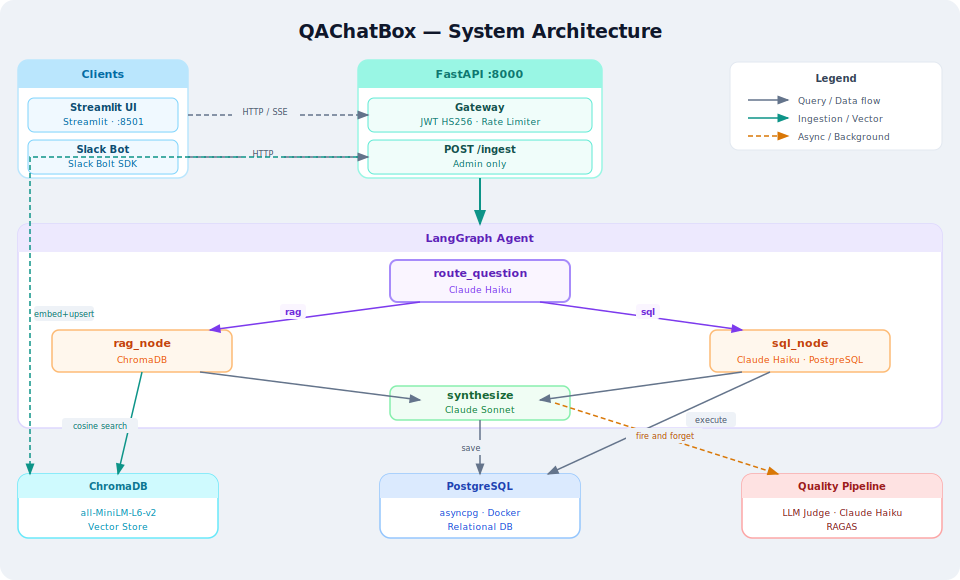

<div align="center">

# QAChatBox

**AI-powered internal knowledge base for companies.**  
Ask questions about HR policies or employee data — in Vietnamese or English — via web UI or Slack.

[](https://python.org)
[](https://fastapi.tiangolo.com)
[](https://github.com/langchain-ai/langgraph)
[](https://anthropic.com)
[](https://trychroma.com)
[](LICENSE)

</div>

---

## Architecture



---

## Overview

QAChatBox is a production-ready RAG chatbot that automatically routes each question to the right data source:

| Question | Routes to | Example |
|---|---|---|
| HR policies, leave rules, onboarding | ChromaDB (semantic search) | *"Chính sách nghỉ thai sản là gì?"* |
| Employee data, headcount, salaries | PostgreSQL (LLM-generated SQL) | *"Average salary in Engineering?"* |

Every response is automatically evaluated by an LLM judge and tracked for quality via RAGAS metrics.

---

## Features

- **Bilingual** — responds in Vietnamese or English based on the user's language
- **Streaming UI** — token-by-token streaming via Server-Sent Events
- **Role-based access** — `admin` can upload documents and view quality metrics; `employee` is read-only
- **Slack bot** — Socket Mode, no public URL needed
- **Quality monitoring** — LLM-as-judge (automatic, per response) + RAGAS (on-demand, batch)
- **User feedback** — thumbs up/down on every assistant message
- **DB ↔ ChromaDB sync** — detect and auto-repair data drift between PostgreSQL and ChromaDB

---

## Tech Stack

| Layer | Technology |
|---|---|
| LLM | Claude Haiku 4.5 · routing & judging · Claude Sonnet 4.6 · synthesis & RAGAS |
| Agent | LangGraph `StateGraph` |
| Vector DB | ChromaDB + `paraphrase-multilingual-MiniLM-L12-v2` (local embeddings) |
| Relational DB | PostgreSQL |
| API | FastAPI (async, SSE streaming, rate-limited) |
| Web UI | Streamlit |
| Auth | JWT HS256, role-based |
| Slack | Slack Bolt SDK (Socket Mode) |
| Deploy | Docker Compose |

---

## Quick Start

### Docker (recommended)

```bash
cp .env.example .env          # add your ANTHROPIC_API_KEY
docker-compose up --build
```

| Service | URL |
|---|---|
| Web UI | http://localhost:8501 |
| API docs | http://localhost:8000/docs |

Default credentials: `admin` / `admin123` · `employee` / `employee123`

### Local Development

Requires **Python 3.11** and **Docker** (for PostgreSQL).

```bash
make install    # create .venv + install all dependencies
make db         # start PostgreSQL container
make seed       # seed DB schema + index policy docs into ChromaDB
make dev        # FastAPI :8000 + Streamlit :8501 with auto-reload
```

---

## Agent Architecture

```
User query
    │
    ▼
route_question          Claude Haiku · classifies into "rag" or "sql"
    │
    ├──► rag_node       ChromaDB semantic search · cosine similarity
    │
    └──► sql_node       Haiku generates SELECT · executes on PostgreSQL
    │
    ▼
synthesize              Claude Sonnet · conversational answer + citations
    │
    ▼
[background] judge      Haiku evaluates helpfulness / factual / hallucination
```

---

## API Reference

Full interactive docs at `/docs` (Swagger UI).

| Method | Endpoint | Auth | Description |
|---|---|---|---|
| `POST` | `/auth/login` | — | Login → JWT token |
| `POST` | `/chat/stream` | user | SSE streaming response |
| `POST` | `/chat` | user | Blocking response (Slack) |
| `POST` | `/feedback` | user | Submit thumbs up/down |
| `GET` | `/sessions` | user | List past conversations |
| `GET` | `/history/{id}` | user | Fetch conversation messages |
| `DELETE` | `/history/{id}` | user | Delete a conversation |
| `POST` | `/ingest` | admin | Upload & index a document |
| `GET` | `/documents` | user | List indexed documents |
| `DELETE` | `/documents/{id}` | admin | Remove a document |
| `GET` | `/sync` | admin | Detect PostgreSQL ↔ ChromaDB drift |
| `POST` | `/sync` | admin | Fix drift (`?reindex=true` for full re-index) |
| `GET` | `/evaluate` | admin | Run RAGAS evaluation |
| `GET` | `/monitoring` | admin | LLM-as-judge results + hallucination flags |
| `GET` | `/health` | — | Health check |

---

## Quality Monitoring

### LLM-as-judge (automatic)

After every response, Haiku evaluates in the background — no latency added to the user.

| Dimension | Scale |
|---|---|
| Helpfulness | 1 – 5 |
| Factual consistency | 1 – 5 |
| Hallucination | yes / no |

View results: `GET /monitoring`

### RAGAS (on-demand)

Batch evaluation on recent conversations. Call `GET /evaluate` from the admin panel.

| Metric | What it measures |
|---|---|
| Faithfulness | Is the answer grounded in retrieved context? |
| Answer relevancy | Does the answer address the question? |
| Context precision | Are retrieved chunks relevant? |

---

## Environment Variables

Copy `.env.example` to `.env` and fill in:

| Variable | Required | Default | Description |
|---|---|---|---|
| `ANTHROPIC_API_KEY` | **Yes** | — | Anthropic API key |
| `JWT_SECRET` | No | `change-me-in-production` | JWT signing secret — **change in prod** |
| `DATABASE_URL` | No | local PostgreSQL | PostgreSQL connection string |
| `ADMIN_PASSWORD` | No | `admin123` | Admin account password |
| `EMPLOYEE_PASSWORD` | No | `employee123` | Employee demo password |
| `SLACK_BOT_TOKEN` | No | — | Bot token (`xoxb-…`) |
| `SLACK_APP_TOKEN` | No | — | App-level token (`xapp-…`) |
| `CLAUDE_MODEL` | No | `claude-haiku-4-5-20251001` | Fast model |
| `CLAUDE_MODEL_SMART` | No | `claude-sonnet-4-6` | Smart model |
| `EMBEDDING_MODEL` | No | `paraphrase-multilingual-MiniLM-L12-v2` | Local embedding model |

---

## Project Structure

```
QAChatBox/
├── src/
│   ├── agent.py              # LangGraph orchestration
│   ├── api.py                # FastAPI endpoints
│   ├── auth.py               # JWT auth + role guards
│   ├── config.py             # Settings via pydantic-settings
│   ├── database.py           # PostgreSQL schema + CRUD
│   ├── document_processor.py # PDF / DOCX / TXT → chunks
│   ├── evaluation.py         # RAGAS evaluation
│   ├── judge.py              # LLM-as-judge background task
│   ├── slack_bot.py          # Slack Bolt (Socket Mode)
│   ├── sync.py               # DB ↔ ChromaDB sync (API layer)
│   ├── tools.py              # rag_tool, sql_tool
│   ├── ui.py                 # Streamlit web UI
│   └── vector_store.py       # ChromaDB wrapper
├── scripts/
│   ├── seed_data.py          # Idempotent DB + ChromaDB seed
│   ├── sync_docs.py          # CLI: detect / fix / reindex
│   └── chroma_inspect.py     # CLI: inspect ChromaDB contents
├── tests/
│   ├── test_tools.py         # Offline unit tests
│   └── test_agent.py         # Routing tests (requires API key)
├── data/
│   ├── leave_policy.txt
│   ├── remote_work_policy.txt
│   ├── code_of_conduct.txt
│   ├── onboarding_guide.txt
│   └── employees.csv
├── Makefile
├── Dockerfile
├── docker-compose.yml
└── entrypoint.sh
```

---

## Slack Setup

1. Go to [api.slack.com/apps](https://api.slack.com/apps) → **Create New App** → From scratch
2. **Socket Mode** → Enable → generate App-Level Token → set as `SLACK_APP_TOKEN`
3. **Event Subscriptions** → subscribe to: `message.im`, `app_mention`
4. **OAuth & Permissions** → Bot Token Scopes: `chat:write`, `im:history`, `app_mentions:read`
5. **Install App** → copy Bot User OAuth Token → set as `SLACK_BOT_TOKEN`
6. Restart the app — the Slack bot starts automatically when both tokens are present

---

## License

MIT
